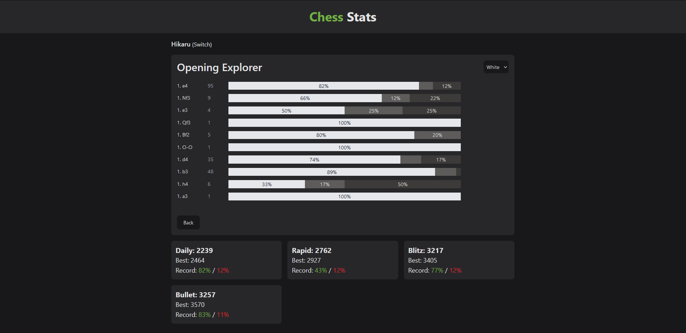
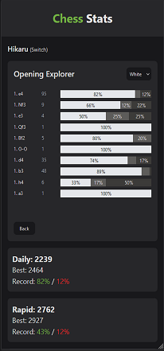

# Chess Tracker

Chess tracker pulls user data from the Chess.com api and allows them to traverse their opening tree and track their winrates.

# Installation

```
git clone https://github.com/gradn0/chess-analyser.git
cd chess-analyser/client
npm install
npm run dev
```

# Screenshots



